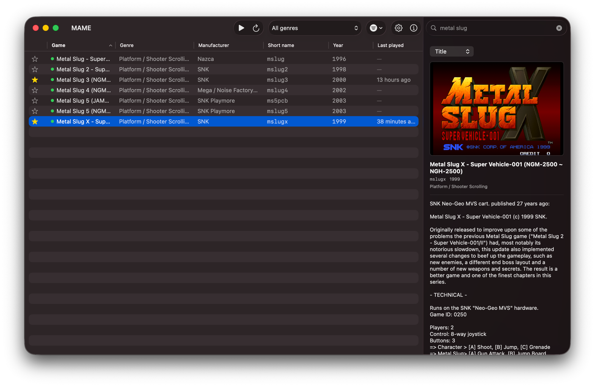

# MAMEFrontend

A minimal native macOS launcher for MAME. Scan your rompath, browse a
searchable list of the games you actually own — shown with real names, not
short codes — and double-click to launch. Built with SwiftUI, arm64-native,
no architecture-specific code required.

Current status: **v0.3.0**.

## Requirements
- macOS 14+ (uses `@Observable`, `ContentUnavailableView`, `Table.primaryAction`)
- Xcode 15+
- A working `mame` binary (e.g. a Homebrew SDL3 arm64 build)

## How it works
- `mame -listfull` builds a shortname → description map for every machine
  MAME knows (parsed once from cheap two-column output — deliberately not
  `-listxml`).
- The rompath is scanned for `*.zip` / `*.7z`; basenames become the owned
  short names.
- Intersecting the two lists gives the owned set, sorted by description.
- Launching runs `mame -rompath <dir> <shortname>`, fire-and-forget in its
  own window.

The app runs **unsandboxed**: it spawns an external binary and reads an
arbitrary folder, so App Sandbox / Hardened Runtime need to stay off. Turning
them on later would require security-scoped bookmarks and entitlements.

## Getting started
1. Open `MAMEFrontend.xcodeproj` in Xcode.
2. Build & run (`⌘R`).
3. On first launch, open **Settings** and point the app at your `mame`
   binary (e.g. `/opt/homebrew/bin/mame`) and your ROM folder.

## Project layout
- `MAMEFrontendApp.swift` — app entry point
- `ContentView.swift` — main UI (searchable game list)
- `Game.swift` — game model
- `LibraryModel.swift` — rompath scanning + `-listfull` intersection
- `MAMERunner.swift` — launching MAME as a subprocess
- `History.swift` — history.xml/.dat parsing
- `package_alpha.sh` — build, ad-hoc sign, and zip a release build

See [`MAMEFrontend/README.md`](MAMEFrontend/README.md) for a from-scratch
assembly guide and [`MAMEFrontend/RELEASE.md`](MAMEFrontend/RELEASE.md) for
the release/packaging process.

## Known limitations
- **Merged sets**: clones living inside a parent archive aren't listed
  individually yet. Fixing this means enriching with `cloneof` data from
  `-listxml <parent>`, streamed via `XMLParser`/SAX rather than DOM-loaded.
- No artwork, genres (`catver.ini`), favorites, or last-played yet.
- MAME CLI flags should be checked against `mame -help` for your specific
  build before being trusted.

## License
No license has been chosen yet — all rights reserved by default until one is
added.
